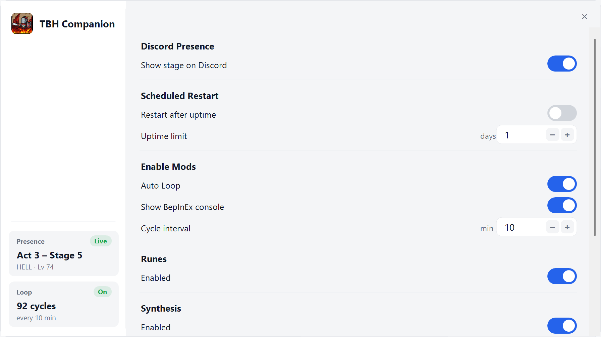

# TBH Companion

A companion app for **TaskBarHero**. One small tray program, two features:

1. **Discord presence** — your Discord profile shows what you're doing in the
   game, live: the stage you're on and the heroes you've deployed.
2. **Auto-synthesis** — the game's Cube synthesis runs by itself: pick
   materials, synthesize, empty the cube, repeat — hands-free.

```
Playing TaskBarHero
Act 3 - Stage 3  (HELL, Lv 72)
Ranger Lv80, Sorcerer Lv23, Priest Lv35
23:41 elapsed
```

## What you need

| For | You need | Notes |
|-----|----------|-------|
| The app itself | Windows 10/11 | Nothing to install — it's a single exe. |
| Discord presence | The [Discord desktop app](https://discord.com/download), logged in | The browser version doesn't support presence. |
| Auto-synthesis | **BepInEx** installed in the game folder (one-time, steps below) | Optional. Without it, only presence runs and the game is never touched. |

## Which download?

The [Releases page](../../releases) has two editions — same presence feature,
your choice on auto-synthesis:

| Download | What it does |
|----------|--------------|
| **`TbhCompanion-Presence.exe`** | Discord presence only. Read-only, never touches the game. The safe choice. |
| **`TbhCompanion.exe`** | Presence **plus** the auto-synthesis mod. |

> **Heads-up on auto-synthesis:** automating item generation is against the
> game's Terms of Service (which prohibit "macros or auto programs" during item
> generation) and could, in principle, lead to item removal or an account ban —
> especially for items tradable on the Marketplace. Use the presence-only build
> if you'd rather not take that risk. The presence feature itself only reads the
> game and is not a game modification.

## Getting started

1. Download the edition you want from the [Releases page](../../releases).
2. Double-click it. A small helmet icon appears in your system tray (near the
   clock) — that's it running.
3. Play TaskBarHero with Discord open. Your profile shows your current stage
   and party within a few seconds.

That's all for presence. The first run after a game update takes about a
minute to read the game; after that it starts instantly.

To stop the app, right-click the tray icon and choose **Quit**.

> **First-run warning:** Windows SmartScreen may show "Windows protected your
> PC" because the app isn't code-signed. Click **More info → Run anyway**. Some
> antivirus tools may also flag it, because it reads another program's memory to
> see your progress — that's expected for this kind of tool.

## Setting up auto-synthesis (one time)

Auto-synthesis is a small mod that runs inside the game, which needs the free
mod loader **BepInEx** installed once. The app can do this for you:

1. With TaskBarHero **closed**, open the Status & Settings window (double-click
   the tray icon).
2. Click **Install mods** and confirm. The app backs up your save, downloads
   BepInEx, and installs it into the game folder for you.
3. Start TaskBarHero once and wait about a minute (BepInEx finishes setting
   itself up), then open the **Cube** panel.

That's it — the button becomes **Remove mods** once it's installed, and the
app keeps the mod up to date after that.

To undo it later: close TaskBarHero, open Status & Settings, and click
**Remove mods**. That deletes BepInEx from the game folder (your save and
Discord presence are untouched). You can optionally use Steam's **Verify
integrity of game files** afterward.

> Prefer to do it by hand? The manual steps (download BepInEx, extract into the
> game folder) are in [CONTRIBUTING.md](CONTRIBUTING.md).

## Using auto-synthesis

Open the **Cube** panel in the game — that's it. The loop starts on its own:
it picks the highest cube level you've unlocked (or a target level you set in
Status & Settings), fills the cube with materials, runs the synthesis, empties
the cube, then waits for the next round (every 5 minutes by default). The Cube
panel must stay open while it works.

In-game keys:

| Key | Action |
|-----|--------|
| **F8** | Turn the auto loop on/off |
| **F9** | Run the synthesis once, manually |
| **F10** | Write a status report to the log (for troubleshooting) |

**Safety:** items above your chosen rarity limit are never synthesized — if
one ends up in the cube, that round is skipped and the cube is emptied. The
mod only presses the game's own buttons; it never edits your items, save, or
memory.

## The Status & Settings window

**Double-click the tray icon** (or right-click → *Status & Settings...*):



Left rail shows live status: Discord presence connection and whether the
auto-synthesis loop is on (with cycle count). The right pane has the settings.

- **Discord Presence** — show your current stage on Discord (also on the tray
  menu). Applies instantly and is remembered next launch.
- **Auto synthesis**
  - **Enable auto synthesis** — arms the loop when the game starts, and syncs
    the running loop when you save (plugin 0.24.1+). F8 still toggles the live
    loop in-game without changing this setting.
  - **which item types** — Equipment, Materials, Accessories (any combination;
    the loop rotates through them),
  - **max rarity** (default: Legendary),
  - **target level** — which cube recipe bracket to use (dropdown matching
    the in-game list: Max / `Lv.1~10` … `Lv.65~80`; default Max = highest
    unlocked),
  - how often a round runs (minutes),
  - show/hide the BepInEx log console (applies on next game start).

Press **Save** — with a current plugin, AutoStart and the other loop settings
reach the running game within ~10 seconds. If the game is still on an older
plugin, restart the game after Save (or after Install mods) so the update
loads. Console visibility always needs a game restart.

## Start it with Windows

Press <kbd>Win</kbd>+<kbd>R</kbd>, type `shell:startup`, press Enter, and put a
shortcut to `TbhCompanion.exe` in the folder that opens. It will sit quietly
and wait for the game whenever you log in.

## Troubleshooting

- **Nothing shows on my Discord profile.** In Discord: **Settings → Activity
  Privacy → "Display current activity as a status message"** must be on, and
  Streamer Mode must not be hiding it. Use the desktop app, not the browser.
- **Auto-synthesis says "game is not running" / "plugin has not reported".**
  The mod isn't loaded yet: check BepInEx is installed (step above), then
  restart the game while `TbhCompanion.exe` is running.
- **Auto-synthesis is ON but nothing happens.** The Cube panel must be open
  in the game — the loop pauses while it's closed.
- **Rounds keep getting skipped.** An item above your rarity limit keeps
  landing in the cube. Raise *Max rarity to synthesize* in Status & Settings,
  or move that item out of reach.
- **Wrong stage shown after a game update.** Give the first run a minute to
  re-read the game. If it stays wrong, the game's internals changed — see
  [CONTRIBUTING.md](CONTRIBUTING.md).

## Privacy & fair use

The presence feature only ever *reads* the game. The auto-synthesis mod
presses the game's own UI buttons and changes nothing else; it's opt-in and
only installed when BepInEx is present. TaskBarHero is a single-player game —
still, mind the game's terms if any online leaderboard exists.

---

Everything technical — building from source, how the memory reading works,
the mod's internals, using your own Discord application, command-line options
— lives in [CONTRIBUTING.md](CONTRIBUTING.md).
