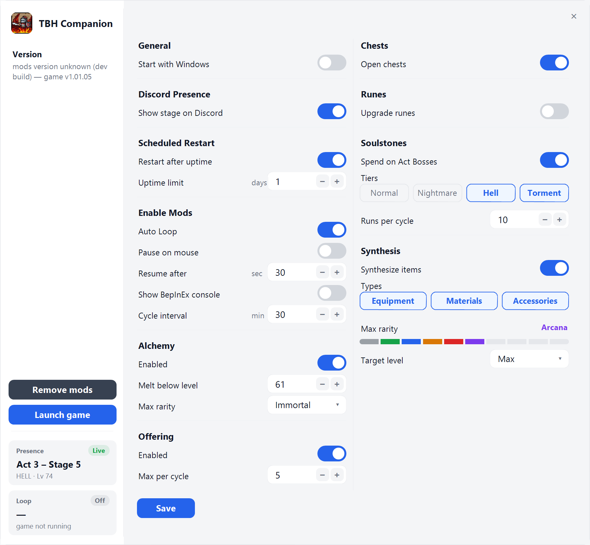

# TBH Companion

[](https://github.com/preschian/tbh-presence/releases)

A companion app for **TaskBarHero**. One small tray program, two features:

1. **Discord presence** — your Discord profile shows what you're doing in the
   game, live: the stage you're on and the heroes you've deployed.
2. **Auto-synthesis** — the game's Cube synthesis runs by itself: pick
   materials, synthesize, empty the cube, repeat — hands-free.

```
Playing TaskBarHero
Act 3 - Stage 3  (HELL, Lv 72)
Ranger Lv80, Sorcerer Lv23, Priest Lv35
23:41 elapsed
```

## What you need

| For | You need | Notes |
|-----|----------|-------|
| The app itself | Windows 10/11 | Nothing to install — it's a single exe. |
| Discord presence | The [Discord desktop app](https://discord.com/download), logged in | The browser version doesn't support presence. |
| Auto-synthesis | **BepInEx** installed in the game folder (one-time, steps below) | Optional. Without it, only presence runs and the game is never touched. |

## Which download?

The [Releases page](../../releases) has two editions — same presence feature,
your choice on auto-synthesis:

| Download | What it does |
|----------|--------------|
| **`TbhCompanion-Presence.exe`** | Discord presence only. Read-only, never touches the game. The safe choice. |
| **`TbhCompanion.exe`** | Presence **plus** the auto-synthesis mod. |

> **Heads-up on auto-synthesis:** automating item generation is against the
> game's Terms of Service (which prohibit "macros or auto programs" during item
> generation) and could, in principle, lead to item removal or an account ban —
> especially for items tradable on the Marketplace. Use the presence-only build
> if you'd rather not take that risk. The presence feature itself only reads the
> game and is not a game modification.

## Getting started

1. Download the edition you want from the [Releases page](../../releases).
2. Double-click it. A small helmet icon appears in your system tray (near the
   clock) — that's it running.
3. Play TaskBarHero with Discord open. Your profile shows your current stage
   and party within a few seconds.

That's all for presence. The first run after a game update takes about a
minute to read the game; after that it starts instantly.

To stop the app, right-click the tray icon and choose **Quit**.

> **First-run warning:** Windows SmartScreen may show "Windows protected your
> PC" because the app isn't code-signed. Click **More info → Run anyway**. Some
> antivirus tools may also flag it, because it reads another program's memory to
> see your progress — that's expected for this kind of tool.

## Setting up auto-synthesis (one time)

Auto-synthesis is a small mod that runs inside the game, which needs the free
mod loader **BepInEx** installed once. The app can do this for you:

1. With TaskBarHero **closed**, open the Status & Settings window (double-click
   the tray icon).
2. Click **Install mods** and confirm. The app backs up your save, downloads
   BepInEx, and installs it into the game folder for you.
3. Start TaskBarHero once and wait about a minute (BepInEx finishes setting
   itself up), then open the **Cube** panel.

That's it — the button becomes **Remove mods** once it's installed, and the
app keeps the mod up to date after that.

To undo it later: close TaskBarHero, open Status & Settings, and click
**Remove mods**. That deletes BepInEx from the game folder (your save and
Discord presence are untouched). You can optionally use Steam's **Verify
integrity of game files** afterward.

> Prefer to do it by hand? The manual steps (download BepInEx, extract into the
> game folder) are in [CONTRIBUTING.md](CONTRIBUTING.md).

## Using auto-synthesis

Open the **Cube** panel in the game — that's it. The loop starts on its own:
it picks the highest cube level you've unlocked (or a target level you set in
Status & Settings), fills the cube with materials, runs the synthesis, empties
the cube, then waits for the next round (every 5 minutes by default). The Cube
panel must stay open while it works.

In-game keys:

| Key | Action |
|-----|--------|
| **F8** | Turn the auto loop on/off |
| **F9** | Run the synthesis once, manually |
| **F10** | Write a status report to the log (for troubleshooting) |

**Safety:** items above your chosen rarity limit are never synthesized — if
one ends up in the cube, that round is skipped and the cube is emptied. The
mod only presses the game's own buttons; it never edits your items, save, or
memory.

## The Status & Settings window

**Double-click the tray icon** (or right-click → *Status & Settings...*):



Left rail shows the **Version** block (whether the mods still match your
installed game build, plus an **Update mods** button when they don't — see
[Keeping the mods in step with the game](#keeping-the-mods-in-step-with-the-game)),
a **Launch game** button, and live status: Discord presence
(stage/difficulty) and the auto-synthesis loop (on/off, cycle count, interval).
The right pane has the settings in two columns:

- **Left**
  - **Discord Presence** — *Show stage on Discord* (also on the tray menu).
    Applies instantly and is remembered next launch.
  - **Scheduled Restart** — optionally close and relaunch TaskBarHero after it
    has been open for a set number of days (1–30). Helps shed RAM on long idle
    sessions. Off by default; enabling (or lowering the day limit) starts a fresh
    countdown so a long-lived session is not killed immediately.
  - **Enable Mods**
    - **Auto Loop** — arms the loop when the game starts, and syncs the running
      loop when you save. F8 still toggles the live loop in-game without changing
      this setting.
    - **Show BepInEx console** — show/hide the log console (applies on next game
      start).
    - **Cycle interval** — how often a round runs (minutes).
  - **Alchemy** — melt junk gear into gold before each round. Off by default.
    - **Enabled** — include the alchemy phase in the cycle,
    - **Melt below level** — gear below this item level is melted, nine items per
      operation (`0`, the default, melts nothing),
    - **Max rarity** (default: Rare) — anything rarer is left alone.

    Locked, reserved, and equipped items are never touched. To see exactly what
    would be melted before anything is destroyed, set `AlchemyDryRun = true` in
    `BepInEx\config\com.pres.tbh.autosynth.cfg` for one round and read the log.
- **Right**
  - **Chests** — *Enabled* opens StageBox chests (Normal / Boss / ActBoss) each
    cycle by clicking the stage UI (does not flip the game's built-in auto-open
    toggle).
  - **Runes** — *Enabled* turns on auto-upgrade runes in the shared cycle.
  - **Synthesis**
    - **Enabled** — include cube synthesis in the cycle,
    - **Types** — Equipment, Materials, Accessories (any combination; the loop
      rotates through them),
    - **Max rarity** (default: Legendary),
    - **Target level** — which cube recipe bracket to use (dropdown matching the
      in-game list: Max / `Lv.1~10` … `Lv.65~80`; default Max = highest unlocked).

Cycle order when several are enabled: **Alchemy → Cube → Chest → Rune**.

Press **Save** — with a current plugin, loop settings reach the running game
within ~10 seconds. If the game is still on an older plugin, restart the game
after Save (or after Install mods) so the update loads. Console visibility
always needs a game restart. Use **Install mods** / **Remove mods** when
BepInEx isn't set up yet or you want it gone.

## Keeping the mods in step with the game

The mods are built against one TaskBarHero build at a time, so a game patch can
leave them out of date. The **Version** section shows where you stand.

Versions line up like this — the mods use a different prefix but the same
build number as the game:

| Role | Shape | Examples |
| --- | --- | --- |
| Game | `v1.X.Y` | `v1.00.28`, `v1.01.02` |
| Mods (companion) | `v3.X.Y` or `v3.X.Y-n` | `v3.00.28`, `v3.00.28-1`, `v3.01.02` |

Only `X.Y` is compared. The `-n` suffix is a mods-only hotfix for the same game
build, so `v3.00.28` and `v3.00.28-1` both match game `v1.00.28`.

What you'll see:

- **Mods matched (v3.01.02 ↔ game v1.01.02)** — nothing to do.
- **Update available: game v1.01.02 → release v3.01.02** — the game moved ahead
  and a matching release exists. Press **Update mods**: it downloads that release
  from GitHub, replaces this app, and restarts it. Your save and settings are
  untouched. The in-game plugin is redeployed once the game isn't holding the
  file open — close TaskBarHero and the companion picks it up within 10 minutes.
- **Waiting for release v3.01.02 (game v1.01.02)** — the game patched but a
  matching mods release isn't out yet. The mods may misbehave until it lands;
  no update is offered.
- **Update check failed (retrying)** — GitHub couldn't be reached. This says
  nothing about whether a release exists; it retries every 5 minutes.
- **mods version unknown (dev build)** — you're running a locally built exe, so
  there's nothing to compare against.

The check runs when you open the window and roughly every 30 minutes after that.
Hover the text to see the full message when it's too long for the rail.

Updating needs write access to the folder the app sits in, so keep
`TbhCompanion.exe` somewhere like your Downloads or a folder of your own rather
than under `Program Files`. If the swap can't be done you'll be told before
anything is replaced.

## Start it with Windows

Press <kbd>Win</kbd>+<kbd>R</kbd>, type `shell:startup`, press Enter, and put a
shortcut to `TbhCompanion.exe` in the folder that opens. It will sit quietly
and wait for the game whenever you log in.

## Troubleshooting

- **Nothing shows on my Discord profile.** In Discord: **Settings → Activity
  Privacy → "Display current activity as a status message"** must be on, and
  Streamer Mode must not be hiding it. Use the desktop app, not the browser.
- **Auto-synthesis says "game is not running" / "plugin has not reported".**
  The mod isn't loaded yet: check BepInEx is installed (step above), then
  restart the game while `TbhCompanion.exe` is running.
- **Auto-synthesis is ON but nothing happens.** The Cube panel must be open
  in the game — the loop pauses while it's closed.
- **Rounds keep getting skipped.** An item above your rarity limit keeps
  landing in the cube. Raise *Max rarity to synthesize* in Status & Settings,
  or move that item out of reach.
- **Wrong stage shown after a game update.** Give the first run a minute to
  re-read the game. If it stays wrong, the game's internals changed — see
  [CONTRIBUTING.md](CONTRIBUTING.md).

## Privacy & fair use

The presence feature only ever *reads* the game. The auto-synthesis mod
presses the game's own UI buttons and changes nothing else; it's opt-in and
only installed when BepInEx is present. TaskBarHero is a single-player game —
still, mind the game's terms if any online leaderboard exists.

---

Everything technical — building from source, how the memory reading works,
the mod's internals, using your own Discord application, command-line options
— lives in [CONTRIBUTING.md](CONTRIBUTING.md).
